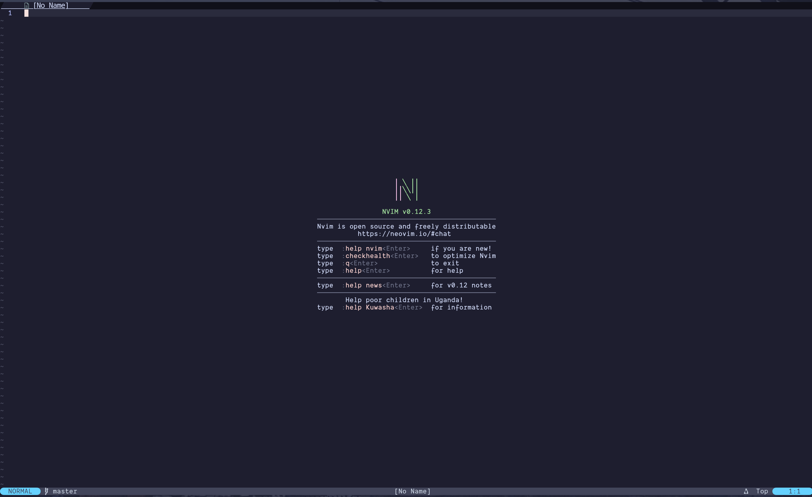

# Dot-files

## NeoVim



## Fonts

In terminals such as alacritty or wezterm I use Dank Mono Nerd Font. You can install it <a href="https://eng.fontke.com/search/font/Dank%20Mono/">here</a> or you can use your own font.

---

## Script:

### `link_configs.sh` – Configs Synchronization Script

> [!WARNING] THIS SCRIPT DOESN'T WORK CORRECTLY NOW, SO PLS, DO NOT USE IT

#### Description

> A simple, safe, and transparent script to symlink dotfiles from `~/dotfiles`.

Synchronizes your configurations across machines with predictable behavior:
📁 `~/dotfiles/home/` → `~/`
📁 `~/dotfiles/.config/` → `~/.config/`

#### Features

- **Safe by default**:
  — Never overwrites regular files or directories.
  — Only updates _symbolic links_ — and only with `--force`.
- **`--dry-run` mode**: preview changes without modifying your system.
- **Colored output**: clearly shows linked, skipped, or existing items.
- Handles nested structures:
  `~/dotfiles/.config/nvim/init.lua` → `~/.config/nvim/init.lua`
- Zero dependencies: pure POSIX-compatible shell (works in `bash`/`zsh`). No `stow`, no Python.

#### Expected `~/dotfiles` Layout

The script assumes this structure:

```
~/dotfiles/
├── home/ # → ~/
│ ├── ...
│ ├── ...
│ └── ...
│
└── .config/ # → ~/.config/
│ ├── ...
│ ├── ...
│ └── ...
│
├── link_configs.sh
├── install_packages.sh
├── ...
└── ...
```

#### How to use:

> [!WARNING] THIS SCRIPT DOESN'T WORK CORRECTLY NOW, SO PLS, DO NOT USE IT

1. Save the script as `~/dotfiles/link_configs`
2. Make it executable:
   ```bash
   chmod +x ~/dotfiles/link_configs
   ```
3. Run it:
   ```zsh
   ./link_configs.sh
   ```

#### Options:

> [!WARNING] THIS SCRIPT DOESN'T WORK CORRECTLY NOW, SO PLS, DO NOT USE IT

| Option               | Description                                             |
| -------------------- | ------------------------------------------------------- |
| `-h`, `--help`       | Show help                                               |
| `-v`, `--version`    | Show version                                            |
| `-n`, `--dry-run`    | Preview mode — show what would be linked (no changes)   |
| `-f`, `--force Skip` | confirmation and overwrite existing symbolic links only |

**These script mean that the dotfiles directory is located along the path `~/dotfiles`, which contains these scripts.**

#### Tools for linux

delta -- prettier git diff. Install it by: `sudo pacman -S delta`
fzf -- the best fuzzy finder. Install it by: `sudo pacman -S fzf`
eza -- like ls but cooler. Install it by: `sudo pacman -S eza`
bat -- like bat but cooler. Install it by: `sudo pacman -S bat`
thefuck -- fuck. Install it by: `sudo pacman -S thefuck`
zoxide -- or z is like cd but more cooler and lazier. Install it by: `sudo pacman -S zoxide`
